# Data Mapping model: Software Engineering for AI-Enabled System

NOTE: To setup the environment, you can follow the [setup guide](setup.md) in the [repository](https://github.com/borbann-platform/data-mapping-model).

## Members

1. Pattadon Loyprasert 6510545608
2. Sirin Phungkun 6510545730

## Table of Contents

- [Data Mapping model: Software Engineering for AI-Enabled System](#data-mapping-model-software-engineering-for-ai-enabled-system)
  - [Members](#members)
  - [Table of Contents](#table-of-contents)
  - [Overview of Project](#overview-of-project)
  - [Section 1: ML Model Implementation](#section-1-ml-model-implementation)
    - [Task 1.1: ML Canvas Design](#task-11-ml-canvas-design)
    - [Task 1.2: Model Training Implementation](#task-12-model-training-implementation)
      - [Input data](#input-data)
      - [Fine-tuning loop](#fine-tuning-loop)
      - [Validation methodology](#validation-methodology)
        - [Validation During Fine-Tuning](#validation-during-fine-tuning)
        - [Post-Fine-Tuning Evaluation](#post-fine-tuning-evaluation)
    - [Task 1.4: Model Versioning and Experimentation](#task-14-model-versioning-and-experimentation)
    - [Task 1.5 + 1.6: Model Explainability + Prediction Reasoning](#task-15--16-model-explainability--prediction-reasoning)
      - [Traceable Prompting](#traceable-prompting)
    - [Task 1.7: Model Deployment as a Service](#task-17-model-deployment-as-a-service)
      - [Input and Output Schema](#input-and-output-schema)
      - [On Scalability](#on-scalability)
  - [Section 2: UI-Model Interface](#section-2-ui-model-interface)
    - [Task 2.1 UI design](#task-21-ui-design)
    - [Task 2.2: Demonstration](#task-22-demonstration)
      - [Model Interface Design](#model-interface-design)
      - [Interface Testing and Implementation](#interface-testing-and-implementation)
        - [Challenges](#challenges)

## Overview of Project

Our projet is [Borbann](https://github.com/borbann-platform/srs-document/blob/main/document.pdf): A real estate information platform that consist of 4 main functionalities
1. Customizable Automated Data Integration Pipeline
   - Automated schema inference: Analyze website structures to identify and extract key data elements
   - Field mapping: Recognize equivalent fields across different sources (e.g., "price" vs "cost")
   - Integration framework: Seamless connection with data export systems
   - Multi-source support: Process data from websites, APIs, and uploaded files
2. Local Contextual Analytics
   - Environmental risk assessment: Evaluate flood risk, natural disaster vulnerability, and air quality
   - Facility proximity analysis: Calculate accessibility to schools, hospitals, transit,
and commercial centers
   - Neighborhood quality scoring: Generate composite metrics for area evaluation
1. Explainable Price Prediction Model
2. Geospatial Visualization

In this report, we will focus on the first functionality: Customizable Automated Data Integration Pipeline. In this module, it need to use AI module to map data from different sources to unified canonical record.

This AI module is a data mapping model that can map data from different sources to unified canonical record.

From this original format obtain from pipeline
```json
  {"records": [
    {
      "source": "scrape",
      "data": {
        // Some data scheme
      }
    },
    {
      "source": "api",
      "data": {
        // Other data scheme
      }
    },
    {
      "source": "file",
      "data": {
        // File data scheme such as csv, json
      }
    }
  ]}
```

To this unified format that can be parsable by pydantic model
```json
{
    "canonical_record_id": "cre-{uuid4()}",
    "original_source_identifier": "https://some.realestate.site/listing/123",
    "original_source_type": "scrape",
    "entity_type": "RealEstateListing",
    "mapping_model_version": "realestate-mapper-v1.0",
    "mapping_timestamp": "2025-04-29T12:00:00Z",
    "address": {
        "street_address": "123 Main St",
        "city": "Anytown",
        "state_province": "CA",
        "postal_code": "90210",
        "country": "USA"
    },
    "features": {
        "bedrooms": 3,
        "bathrooms": 2.5,
        "area_sqft": 1850.0,
        "lot_size_sqft": 5500.0,
        "year_built": 1995,
        "property_type": "Single Family House",
        "has_pool": True,
        "has_garage": True,
        "stories": 2
    },
    "listing": {
        "price": 750000.0,
        "currency": "USD",
        "listing_status": "For Sale",
        "listing_type": "Sale",
        "listed_date": "2025-04-15T00:00:00Z",
        "last_updated_date": "2025-04-28T00:00:00Z",
        "listing_url": "https://some.realestate.site/listing/123",
        "mls_id": "MLS123456"
    },
    "agent": {
        "name": "Jane Doe",
        "phone": "555-123-4567",
        "email": "jane.doe@email.com",
        "brokerage_name": "Best Realty"
    },
    "description": "Beautiful 3 bed, 2.5 bath home in a great neighborhood. Recently updated kitchen, spacious backyard with pool.",
    "image_urls": [
        "https://images.site/123/1.jpg",
        "https://images.site/123/2.jpg",
    ],
    "raw_source_data": {
        "title": "Charming Home For Sale",
        "price_str": "$750,000",
        "sqft": "1,850",
        "...": "...",
    },
}
```

## Section 1: ML Model Implementation

### Task 1.1: ML Canvas Design

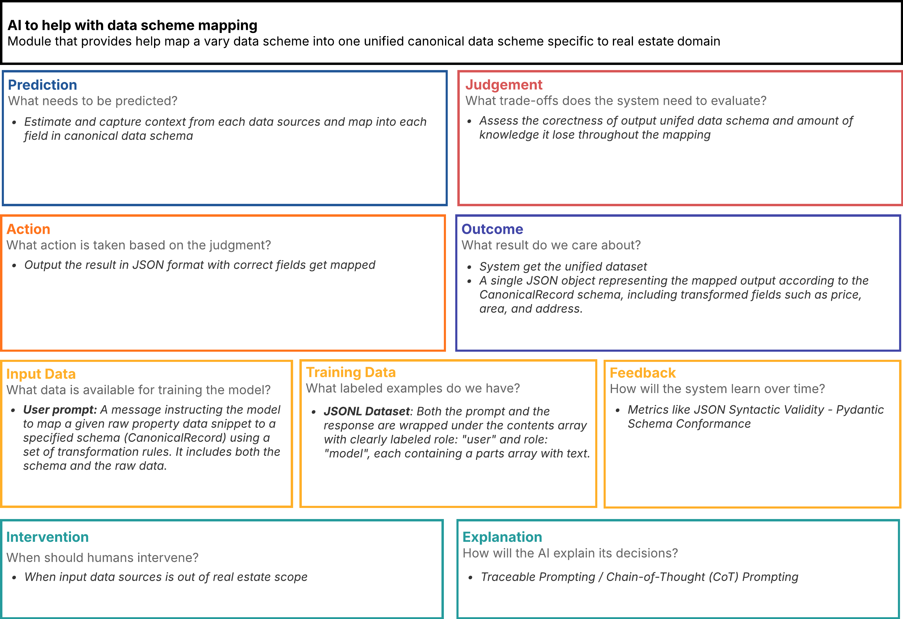

The AI Canvas comprises eight interconnected sections that collectively define the system's purpose and operation. The Prediction section establishes the core functionality: estimating and capturing context from each data source and mapping it into each field in the canonical data schema. This works in concert with the Judgment section, which articulates the critical trade-offs the system must evaluate, focusing on assessing the correctness of the output unified data schema and measuring the amount of knowledge potentially lost throughout the mapping process.

The Action section defines how the system's outputs are translated into tangible steps, outputting the results in JSON format with correctly mapped fields. These actions lead to the Outcome section, which clarifies the ultimate value proposition: generating a unified dataset represented as a single JSON object conforming to the CanonicalRecord schema, including transformed fields such as price, area, and address.

The Input Data section catalogues the available information sources: user prompts containing instructions for mapping raw property data snippets to a specified schema (CanonicalRecord) using transformation rules, including both the schema specifications and the raw data itself. Complementing this, the Training Data section defines the labeled examples powering the model: JSONL datasets where both prompts and responses are wrapped in contents arrays with clearly labeled roles ("user" and "model"), each containing parts arrays with text.

The Feedback section outlines how the model will learn over time by tracking metrics like JSON Syntactic Validity and Pydantic Schema Conformance. The Intervention section establishes boundaries for human oversight, calling for expert involvement when input data sources fall outside the real estate scope. The Explanation section details the technical approaches for transparency: Traceable Prompting and Chain-of-Thought (CoT) Prompting methodologies to provide insight into the system's decision-making processes.


### Task 1.2: Model Training Implementation

I did not train the LLM model by myself but instead, I do fine-tuning on `gemini-2.0-flash-lite-001` in vertex AI platform with supervised learning approach.

#### Input data

Here is example of training data I use to fine-tune the model:
```json
{"contents":[{"role":"user","parts":[{"text":"You are a data mapping assistant. Your task is to map the provided 'Raw Property Data Snippet' to the 'CanonicalRecord Schema Definition'. \n\nRULES:\n- Your entire response must be ONLY the mapped JSON object string, conforming strictly to the CanonicalRecord schema.\n- Do NOT include any explan...line\": \"2024-02-10T00:00:00Z\"}"}]},{"role":"model","parts":[{"text":"{\"canonical_record_id\": \"cre-GENERATED-UUID\", \"original_source_identifier\": \"https://www.baania.com/some-property-link-v2\", \"original_source_type\": \"scrape\", \"entity_type\": \"RealEstateListing\", \"mapping_model_version\": null, \"mapping_timestamp\": \"2024-02-10T00:00:00Z\", \"address\": {\"street_address\": \"Sukhumvit Soi 31\", \"city\": \"Ban...., Wattana. Excellent amenities including pool, gym, and 24-hour security. Built 2018.\", \"images\": [\"https://cdn.baania.com/img/condo/A1.jpg\", \"https://cdn.baania.com/img/condo/A2.jpg\"], \"contact\": {\"agency\": \"Urban Living Thailand\", \"tel\": \"+66-81-234-5678\"}, \"date_online\": \"2024-02-10T00:00:00Z\"}}"}]}]}
```
It is in JSONL or JSONLines format which suitable for large scale training data, these datas are combination from two sources
1. Collected from my pipeline service
- Combine the data output from pipeline with specific prompt to create user role and define the target canonical dataset for model role
1. Generate with `Gemini 2.5 Flash Preview 04-17` with this prompt
- Craft prompt to more synthetic datas and cover more cases

We need to do data generation because pipeline process take a lot of time to scrape data from web.

Separate into 3 versions

- [`train-1.jsonl`](data/train/train-1.jsonl): 1 samples (2207 tokens)
- [`train-2.jsonl`](data/train/train-2.jsonl): 19 samples (33320 tokens) + 12 samples `evluation.jsonl`
- [`train-3.jsonl`](data/train/train-3.jsonl): 25 samples (43443 tokens) + 12 samples `evluation.jsonl`

#### Fine-tuning loop

In Vertex AI plaform, I use tuning job to fine-tune the model. We can specify the training data and evaluation data in the tuning job.
Those datas need to be in JSONL format.

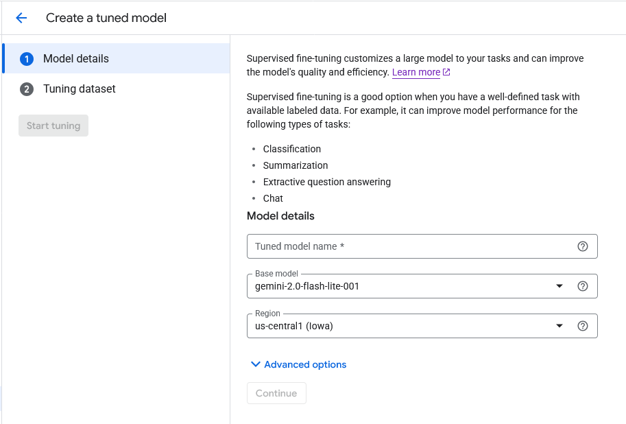
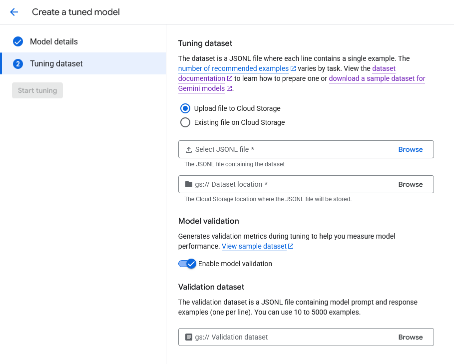

#### Validation methodology
For validation, we separate into two parts
1. Validation During Fine-Tuning 
2. Post-Fine-Tuning Evaluation 

##### Validation During Fine-Tuning

During fine-tuning, if we provide evaluation data, Vertex AI will calculate the metrics for us.

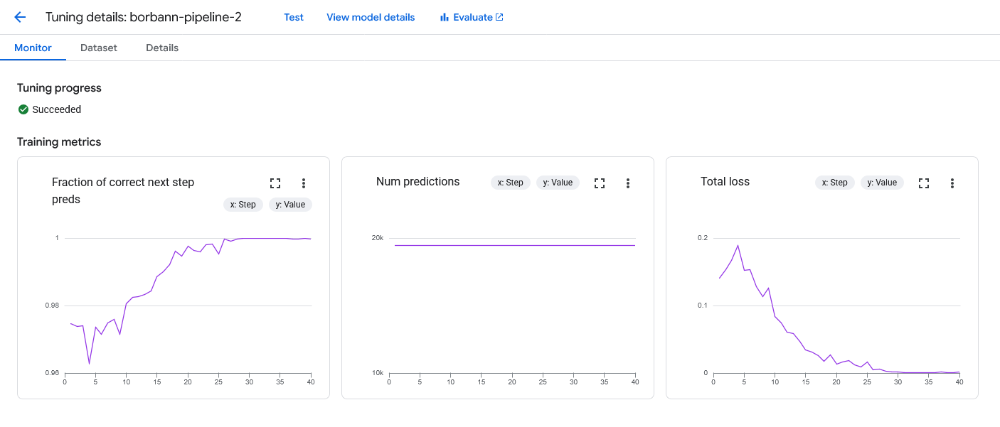
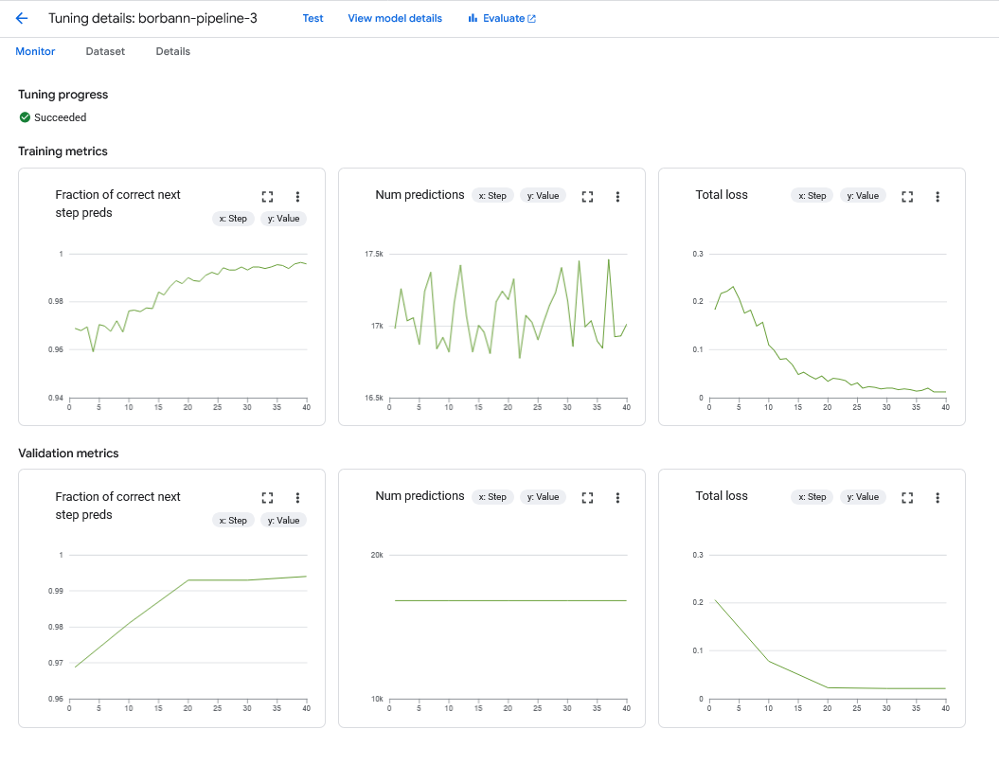
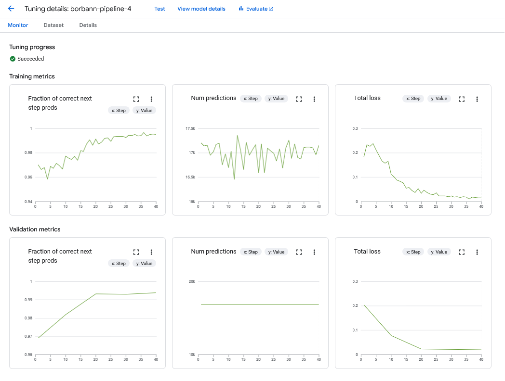

##### Post-Fine-Tuning Evaluation

We approach two methods

1. JSON Syntactic Validity: Parse generated json string with `json.loads()`
2. Pydantic Schema Conformance: If the generated output is valid JSON, try to instantiate on [`CanonicalRecord Pydantic model`](schemas/canonical.py) with the parsed dictionary: `CanonicalRecord(**parsed_generated_json)`.

To calculate the metrics, I run the following code

```bash
uv sync
gcloud auth application-default login # This is required to authenticate with my account
uv run evaluate.py
```

All models are evaluated on these settings.

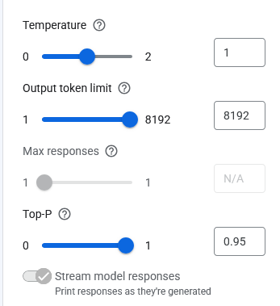

Here are the results

```markdown
# JSON Syntactic Validity:
CustomModel.BORBANN_PIPELINE_2: 91.67%
CustomModel.BORBANN_PIPELINE_3: 100.00%
CustomModel.BORBANN_PIPELINE_4: 100.00%

# Pydantic Schema Conformance (CanonicalRecord Validation Rate):
CustomModel.BORBANN_PIPELINE_2: 63.64%
CustomModel.BORBANN_PIPELINE_3: 0.00%
CustomModel.BORBANN_PIPELINE_4: 0.00%
```

We can see that `borbann-pipeline-2` has the best performance in JSON Syntactic Validity but the worst in Pydantic Schema Conformance.
While `borbann-pipeline-3` and `borbann-pipeline-4` has the best performance in Pydantic Schema Conformance but the worst in JSON Syntactic Validity.

We pick `borbann-pipeline-2` as the final model to deploy according to the evaluation result.

Maybe, this is because the prompt we use to fine-tune the model is not good enough to cover all the cases and provide wrong schema, when we put more data into the model, it fit with that wrong output schema.

For the numerical detail, we can see the [`evaluation_results.json`](evaluation_results.json) file in the repository.

### Task 1.4: Model Versioning and Experimentation

Instead of MLFlow, Vertex AI platform provide model versioning and experimentation through Colab Enterprise for us. It also provide prompt versioning to track the changes of prompt too.

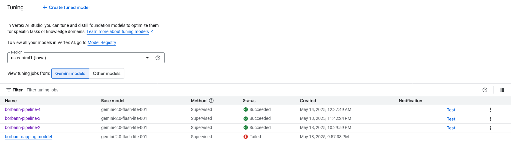

We have 3 versions of model
- `borbann-pipeline-2`: 1 samples (2207 tokens)
- `borbann-pipeline-3`: 19 samples (33320 tokens) + evaluation samples (12 samples)
- `borbann-pipeline-4`: 25 samples (43443 tokens) + evaluation samples (12 samples)

Each version differ by the training data amount but are the same on model settings such as temperature, output max length, etc.

### Task 1.5 + 1.6: Model Explainability + Prediction Reasoning

For model explainability and prediction reasoning, we follow the `Traceable Prompting / Chain-of-Thought (CoT) Prompting` method. In this case, I use this prompt

```markdown
Explain how to generate output in a format that can be easily parsed by downstream 
systems in "reasoning steps" key then output the canonical record.
```

To calculate the metrics, I run the following code

```bash
uv sync
uv run explainability.py
```

The model will explain intuitive behind its decision to us, here is a portion of it

```markdown
*   **reasoning steps:** A list of dictionaries. Each dictionary represents a reasoning step. Each dictionary has keys like:
    *   **step_number:** The numerical order of the step.
    *   **description:** A natural language description of the step (e.g., "Applying rule X to deduce Y").
    *   **input:** The input to the reasoning step (e.g., facts, observations).
    *   **output:** The output of the reasoning step (e.g., new facts, conclusions).
    *   **rule:** (Optional) The rule applied in the step.
*   **canonical record:** A structured representation of the canonical information. The structure depends on the input type and the task. General considerations:
    *   **Entities:**  Represent entities with unique identifiers (UUIDs recommended). Include attributes like name, type, and other relevant details.
    *   **Relationships:**  Represent relationships between entities using predicates (e.g., "works_for," "located_in"). Include attributes like start date, end date, etc.
    *   **Events:**  Represent events with unique identifiers (UUIDs recommended). Include attributes like event type, participants (linked entities), location, time, and other relevant details.

```

For full output, you can see the [`explainability.json`](explainability.json) file.

#### Traceable Prompting

We add `Traceable Prompting` to the prompt to make the model explainable.

### Task 1.7: Model Deployment as a Service

Model are deployed as a service in Vertex AI platform via GCP Compute Engine. We pick `borbann-pipeline-2` as the final model to deploy according to the evaluation result.

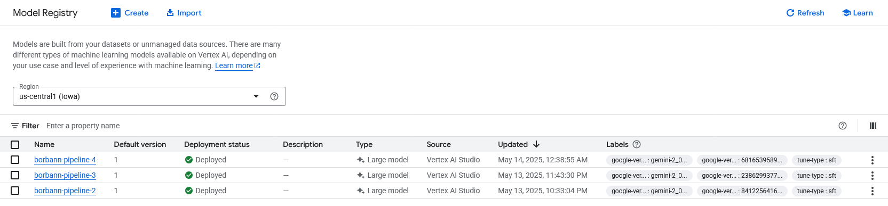

Anyway, currently we are not using this model with the pipeline service yet, so we will demonstrate it manually.

#### Input and Output Schema

You can take a look at the [`input.json`](data/input.json) and [`output.json`](data/output.json) files to see the input and output schema.

input.json
```json
{
    "prompt": "You are a data mapping assistant. Your task is to map the provided 'Raw Property Data Snippet' to the 'CanonicalRecord Schema Definition'. \n\nRULES:\n- Your entire response must be ONLY the mapped JSON object string, conforming strictly to the CanonicalRecord schema.\n- Do NOT include any explanatory text before or after the JSON object.\n- Set 'original_source_type' to: api\n- Set 'original_source_identifier' to: https://api.globalmls.com/listing/def456\n- Set 'entity_type' to 'RealEstateListing'.\n- For the 'raw_source_data' field in the output, include the exact 'Raw Property Data Snippet' you were given.\n- Perform necessary data transformations (e.g., string prices to numbers, parse dates, extract address components).\n- If information for a canonical field is not present, use `null` or omit optional fields as per the schema.\n\nCanonicalRecord Schema Definition:\n{\"title\": \"CanonicalRecord\", \"type\": \"object\", \"properties\": {\"canonical_record_id\": {\"type\": \"string\", \"description\": \"Unique identifier for this canonical record.\", \"examples\": [\"cre-SOME_UUID\"]}, \"original_source_identifier\": {\"type\": \"string\", \"description\": \"Identifier of the original source (e.g., URL, filename + row index).\"}, \"original_source_type\": {\"type\": \"string\", \"enum\": [\"api\", \"file\", \"scrape\"], \"description\": \"Type of the original source adapter ('api', 'file', 'scrape').\"}, \"entity_type\": {\"type\": \"string\", \"enum\": [\"RealEstateListing\", \"NewsArticle\", \"Other\"], \"default\": \"Other\", \"description\": \"Classification of the source entity.\"}, \"mapping_model_version\": {\"type\": [\"string\", \"null\"], \"description\": \"Version identifier of the ML model used for mapping.\"}, \"mapping_timestamp\": {\"type\": \"string\", \"format\": \"date-time\", \"description\": \"Timestamp (UTC) when the mapping was performed.\"}, \"address\": {\"title\": \"Address\", \"type\": [\"object\", \"null\"], \"properties\": {\"street_address\": {\"type\": [\"string\", \"null\"]}, \"city\": {\"type\": [\"string\", \"null\"]}, \"state_province\": {\"type\": [\"string\", \"null\"]}, \"postal_code\": {\"type\": [\"string\", \"null\"]}, \"country\": {\"type\": [\"string\", \"null\"], \"default\": \"USA\"}}}, \"features\": {\"title\": \"Features\", \"type\": [\"object\", \"null\"], \"properties\": {\"bedrooms\": {\"type\": [\"integer\", \"null\"]}, \"bathrooms\": {\"type\": [\"number\", \"null\"]}, \"area_sqft\": {\"type\": [\"number\", \"null\"], \"description\": \"Area in square feet.\"}, \"lot_size_sqft\": {\"type\": [\"number\", \"null\"], \"description\": \"Lot size in square feet.\"}, \"year_built\": {\"type\": [\"integer\", \"null\"]}, \"property_type\": {\"type\": [\"string\", \"null\"]}, \"has_pool\": {\"type\": [\"boolean\", \"null\"]}, \"has_garage\": {\"type\": [\"boolean\", \"null\"]}, \"stories\": {\"type\": [\"integer\", \"null\"]}}}, \"listing\": {\"title\": \"Listing Information\", \"type\": [\"object\", \"null\"], \"properties\": {\"price\": {\"type\": [\"number\", \"null\"]}, \"currency\": {\"type\": [\"string\", \"null\", \"string\"], \"default\": \"USD\"}, \"listing_status\": {\"type\": [\"string\", \"null\"]}, \"listing_type\": {\"type\": [\"string\", \"null\"]}, \"listed_date\": {\"type\": [\"string\", \"null\", \"string\"], \"format\": \"date-time\"}, \"last_updated_date\": {\"type\": [\"string\", \"null\", \"string\"]}, \"listing_url\": {\"type\": [\"string\", \"null\", \"string\"]}, \"mls_id\": {\"type\": [\"string\", \"null\"]}}}, \"agent\": {\"title\": \"Agent Information\", \"type\": [\"object\", \"null\"], \"properties\": {\"name\": {\"type\": [\"string\", \"null\"]}, \"phone\": {\"type\": [\"string\", \"null\"]}, \"email\": {\"type\": [\"string\", \"null\"]}, \"brokerage_name\": {\"type\": [\"string\", \"null\"]}}}, \"description\": {\"type\": [\"string\", \"null\"]}, \"image_urls\": {\"type\": [\"array\", \"null\"], \"items\": {\"type\": \"string\", \"format\": \"uri\"}}, \"raw_source_data\": {\"type\": [\"object\", \"null\"], \"description\": \"Original source data record (JSON representation).\"}}, \"required\": [\"original_source_identifier\", \"original_source_type\", \"entity_type\"]}\n\nOriginal Source Type: api\nOriginal Source Identifier: https://api.globalmls.com/listing/def456\n\nRaw Property Data Snippet:\n{\"mls_number\": \"DEF456\", \"property\": {\"address\": {\"street\": \"1600 Pennsylvania Ave NW\", \"city\": \"Washington\", \"state\": \"DC\", \"zip\": \"20500\", \"country\": \"USA\"}, \"features\": {\"bed\": 16, \"bath\": 35.0, \"area\": 55000, \"type\": \"Historic Residence\", \"year_built\": 1800}}, \"pricing\": {\"list_price\": 100000000, \"currency\": \"USD\", \"listing_type\": \"Sale\"}, \"agent\": {\"name\": \"Official Agent\", \"brokerage\": \"Government Properties\"}, \"description_short\": \"Iconic historic property.\", \"photos\": [\"https://api.globalmls.com/img/def456_ext.jpg\"]}"
}
```

output.json
```json
{
    "text": "{\"canonical_record_id\": \"cre-GENERATED-UUID\", \"original_source_identifier\": \"https://api.globalmls.com/listing/def456\", \"original_source_type\": \"api\", \"entity_type\": \"RealEstateListing\", \"mapping_model_version\": null, \"mapping_timestamp\": null, \"address\": {\"street_address\": \"1600 Pennsylvania Ave NW\", \"city\": \"Washington\", \"state_province\": \"DC\", \"postal_code\": \"20500\", \"country\": \"USA\"}, \"features\": {\"bedrooms\": 16, \"bathrooms\": 35.0, \"area_sqft\": 55000.0, \"lot_size_sqft\": null, \"year_built\": 1800, \"property_type\": \"Historic Residence\", \"has_pool\": null, \"has_garage\": null, \"stories\": null}, \"listing\": {\"price\": 100000000.0, \"currency\": \"USD\", \"listing_status\": null, \"listing_type\": \"Sale\", \"listed_date\": null, \"last_updated_date\": null, \"listing_url\": null, \"mls_id\": \"DEF456\"}, \"agent\": {\"name\": \"Official Agent\", \"phone\": null, \"email\": null, \"brokerage_name\": \"Government Properties\"}, \"description\": \"Iconic historic property.\", \"image_urls\": [\"https://api.globalmls.com/img/def456_ext.jpg\"], \"raw_source_data\": {\"mls_number\": \"DEF456\", \"property\": {\"address\": {\"street\": \"1600 Pennsylvania Ave NW\", \"city\": \"Washington\", \"state\": \"DC\", \"zip\": \"20500\", \"country\": \"USA\"}, \"features\": {\"bed\": 16, \"bath\": 35.0, \"area\": 55000, \"type\": \"Historic Residence\", \"year_built\": 1800}}, \"pricing\": {\"list_price\": 100000000, \"currency\": \"USD\", \"listing_type\": \"Sale\"}, \"agent\": {\"name\": \"Official Agent\", \"brokerage\": \"Government Properties\"}, \"description_short\": \"Iconic historic property.\", \"photos\": [\"https://api.globalmls.com/img/def456_ext.jpg\"]}}"
}
```

#### On Scalability

Scalability is not a problem here because we deploy mondel on compute engine which has high elaticity and can scale up when large volume of request come in.

## Section 2: UI-Model Interface

### Task 2.1 UI design

This AI component is not directly show up on UI, it is automated process to map data of pipeline service to canonical record.
Anyway, I will show the UI of pipeline service to show the data that we use to map to canonical record.

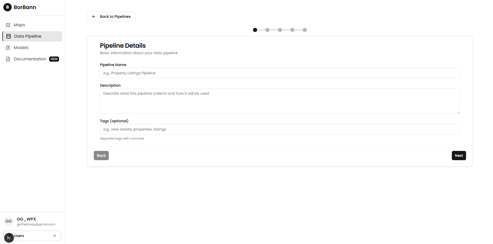
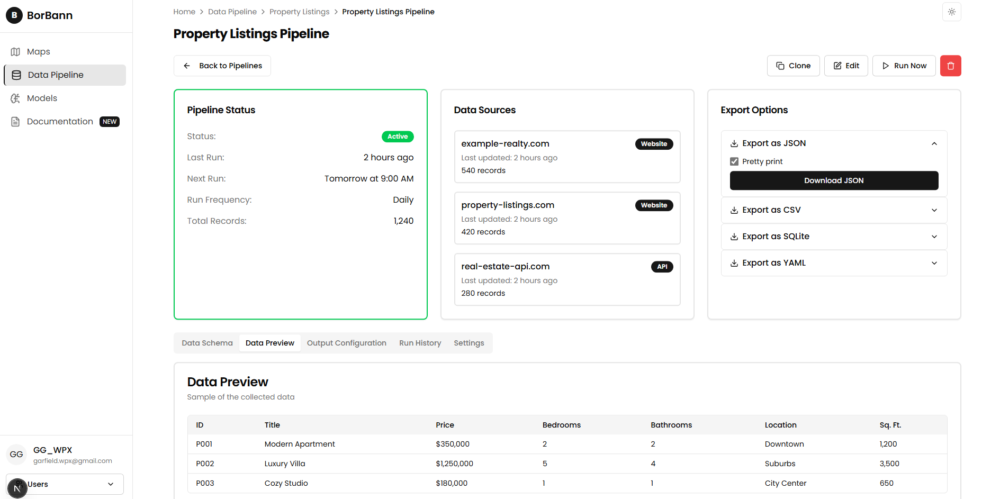
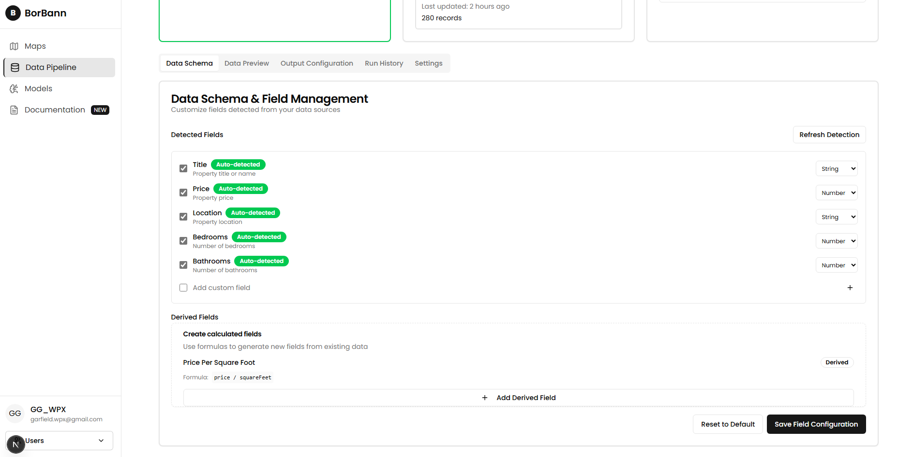

We don't have any UI to gain feedback from user at this time, but we plan to add it in the future.

### Task 2.2: Demonstration

#### Model Interface Design

Here is the complete payload from each pipeline service to be sent to preprocessing unit.

```json
  {"records": [
    {
      "source": "scrape",
      "data": {
        // Some data scheme
      }
    },
    {
      "source": "api",
      "data": {
        // Other data scheme
      }
    },
    {
      "source": "file",
      "data": {
        // File data scheme such as csv, json
      }
    }
  ]}
```

After preprocessing unit, the this type of [input payload](data/input.json) will be sent to model.

```json
{
    "prompt": "You are a data mapping assistant. Your task is to map the provided 'Raw Property Data Snippet' to the 'CanonicalRecord Schema Definition'. \n\nRULES:\n- Your entire response must be ONLY the mapped JSON object string, conforming strictly to the CanonicalRecord schema.\n- Do NOT include any explanatory text before or after the JSON object.\n- Set 'original_source_type' to: api\n- Set 'original_source_identifier' to: https://api.globalmls.com/listing/def456\n- Set 'entity_type' to 'RealEstateListing'.\n- For the 'raw_source_data' field in the output, include the exact 'Raw Property Data Snippet' you were given.\n- Perform necessary data transformations (e.g., string prices to numbers, parse dates, extract address components).\n- If information for a canonical field is not present, use `null` or omit optional fields as per the schema.\n\nCanonicalRecord Schema Definition:\n{\"title\": \"CanonicalRecord\", \"type\": \"object\", \"properties\": {\"canonical_record_id\": {\"type\": \"string\", \"description\": \"Unique identifier for this canonical record.\", \"examples\": [\"cre-SOME_UUID\"]}, \"original_source_identifier\": {\"type\": \"string\", \"description\": \"Identifier of the original source (e.g., URL, filename + row index).\"}, \"original_source_type\": {\"type\": \"string\", \"enum\": [\"api\", \"file\", \"scrape\"], \"description\": \"Type of the original source adapter ('api', 'file', 'scrape').\"}, \"entity_type\": {\"type\": \"string\", \"enum\": [\"RealEstateListing\", \"NewsArticle\", \"Other\"], \"default\": \"Other\", \"description\": \"Classification of the source entity.\"}, \"mapping_model_version\": {\"type\": [\"string\", \"null\"], \"description\": \"Version identifier of the ML model used for mapping.\"}, \"mapping_timestamp\": {\"type\": \"string\", \"format\": \"date-time\", \"description\": \"Timestamp (UTC) when the mapping was performed.\"}, \"address\": {\"title\": \"Address\", \"type\": [\"object\", \"null\"], \"properties\": {\"street_address\": {\"type\": [\"string\", \"null\"]}, \"city\": {\"type\": [\"string\", \"null\"]}, \"state_province\": {\"type\": [\"string\", \"null\"]}, \"postal_code\": {\"type\": [\"string\", \"null\"]}, \"country\": {\"type\": [\"string\", \"null\"], \"default\": \"USA\"}}}, \"features\": {\"title\": \"Features\", \"type\": [\"object\", \"null\"], \"properties\": {\"bedrooms\": {\"type\": [\"integer\", \"null\"]}, \"bathrooms\": {\"type\": [\"number\", \"null\"]}, \"area_sqft\": {\"type\": [\"number\", \"null\"], \"description\": \"Area in square feet.\"}, \"lot_size_sqft\": {\"type\": [\"number\", \"null\"], \"description\": \"Lot size in square feet.\"}, \"year_built\": {\"type\": [\"integer\", \"null\"]}, \"property_type\": {\"type\": [\"string\", \"null\"]}, \"has_pool\": {\"type\": [\"boolean\", \"null\"]}, \"has_garage\": {\"type\": [\"boolean\", \"null\"]}, \"stories\": {\"type\": [\"integer\", \"null\"]}}}, \"listing\": {\"title\": \"Listing Information\", \"type\": [\"object\", \"null\"], \"properties\": {\"price\": {\"type\": [\"number\", \"null\"]}, \"currency\": {\"type\": [\"string\", \"null\", \"string\"], \"default\": \"USD\"}, \"listing_status\": {\"type\": [\"string\", \"null\"]}, \"listing_type\": {\"type\": [\"string\", \"null\"]}, \"listed_date\": {\"type\": [\"string\", \"null\", \"string\"], \"format\": \"date-time\"}, \"last_updated_date\": {\"type\": [\"string\", \"null\", \"string\"]}, \"listing_url\": {\"type\": [\"string\", \"null\", \"string\"]}, \"mls_id\": {\"type\": [\"string\", \"null\"]}}}, \"agent\": {\"title\": \"Agent Information\", \"type\": [\"object\", \"null\"], \"properties\": {\"name\": {\"type\": [\"string\", \"null\"]}, \"phone\": {\"type\": [\"string\", \"null\"]}, \"email\": {\"type\": [\"string\", \"null\"]}, \"brokerage_name\": {\"type\": [\"string\", \"null\"]}}}, \"description\": {\"type\": [\"string\", \"null\"]}, \"image_urls\": {\"type\": [\"array\", \"null\"], \"items\": {\"type\": \"string\", \"format\": \"uri\"}}, \"raw_source_data\": {\"type\": [\"object\", \"null\"], \"description\": \"Original source data record (JSON representation).\"}}, \"required\": [\"original_source_identifier\", \"original_source_type\", \"entity_type\"]}\n\nOriginal Source Type: api\nOriginal Source Identifier: https://api.globalmls.com/listing/def456\n\nRaw Property Data Snippet:\n{\"mls_number\": \"DEF456\", \"property\": {\"address\": {\"street\": \"1600 Pennsylvania Ave NW\", \"city\": \"Washington\", \"state\": \"DC\", \"zip\": \"20500\", \"country\": \"USA\"}, \"features\": {\"bed\": 16, \"bath\": 35.0, \"area\": 55000, \"type\": \"Historic Residence\", \"year_built\": 1800}}, \"pricing\": {\"list_price\": 100000000, \"currency\": \"USD\", \"listing_type\": \"Sale\"}, \"agent\": {\"name\": \"Official Agent\", \"brokerage\": \"Government Properties\"}, \"description_short\": \"Iconic historic property.\", \"photos\": [\"https://api.globalmls.com/img/def456_ext.jpg\"]}"
}
```

And we will get the [output payload](data/output.json) from model. Then parse the output payload to [canonical record](schemas/canonical.py).

```json
{
    "text": "{\"canonical_record_id\": \"cre-GENERATED-UUID\", \"original_source_identifier\": \"https://api.globalmls.com/listing/def456\", \"original_source_type\": \"api\", \"entity_type\": \"RealEstateListing\", \"mapping_model_version\": null, \"mapping_timestamp\": null, \"address\": {\"street_address\": \"1600 Pennsylvania Ave NW\", \"city\": \"Washington\", \"state_province\": \"DC\", \"postal_code\": \"20500\", \"country\": \"USA\"}, \"features\": {\"bedrooms\": 16, \"bathrooms\": 35.0, \"area_sqft\": 55000.0, \"lot_size_sqft\": null, \"year_built\": 1800, \"property_type\": \"Historic Residence\", \"has_pool\": null, \"has_garage\": null, \"stories\": null}, \"listing\": {\"price\": 100000000.0, \"currency\": \"USD\", \"listing_status\": null, \"listing_type\": \"Sale\", \"listed_date\": null, \"last_updated_date\": null, \"listing_url\": null, \"mls_id\": \"DEF456\"}, \"agent\": {\"name\": \"Official Agent\", \"phone\": null, \"email\": null, \"brokerage_name\": \"Government Properties\"}, \"description\": \"Iconic historic property.\", \"image_urls\": [\"https://api.globalmls.com/img/def456_ext.jpg\"], \"raw_source_data\": {\"mls_number\": \"DEF456\", \"property\": {\"address\": {\"street\": \"1600 Pennsylvania Ave NW\", \"city\": \"Washington\", \"state\": \"DC\", \"zip\": \"20500\", \"country\": \"USA\"}, \"features\": {\"bed\": 16, \"bath\": 35.0, \"area\": 55000, \"type\": \"Historic Residence\", \"year_built\": 1800}}, \"pricing\": {\"list_price\": 100000000, \"currency\": \"USD\", \"listing_type\": \"Sale\"}, \"agent\": {\"name\": \"Official Agent\", \"brokerage\": \"Government Properties\"}, \"description_short\": \"Iconic historic property.\", \"photos\": [\"https://api.globalmls.com/img/def456_ext.jpg\"]}}"
}
```

Here is sequence diagram of the process.

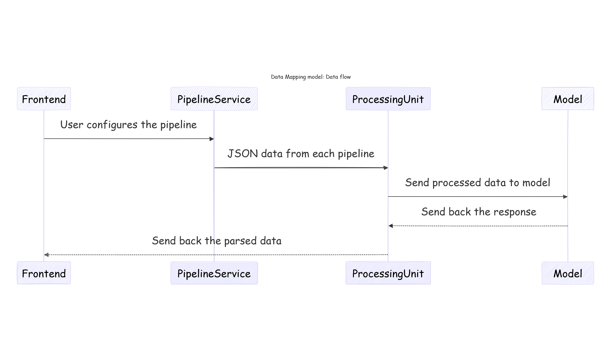

#### Interface Testing and Implementation

As I said that this model is not directly show up on UI, it is automated process to map data of pipeline service to canonical record.
Anyway, I will show the prompting input and result through Vertex AI platform. Here are results of testing with model `borbann-pipeline-2`

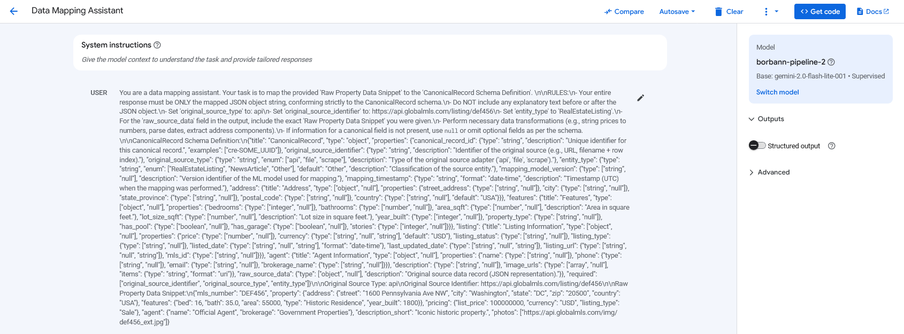
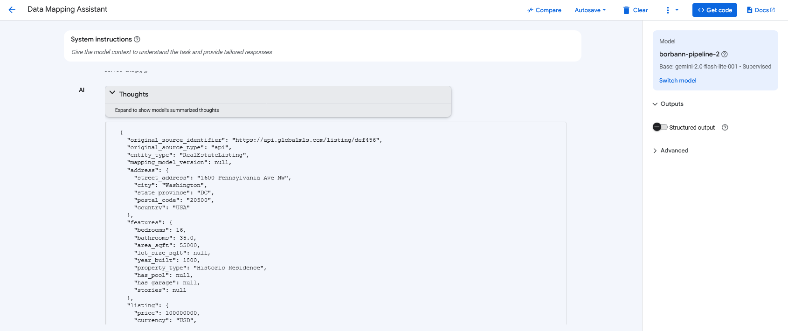

##### Challenges

1. Prompt is not dynamically change based on pydantic model.
   - We found out that we can embeded the pydantic schema into prompt directly so it can update automatically when we change the pydantic model.